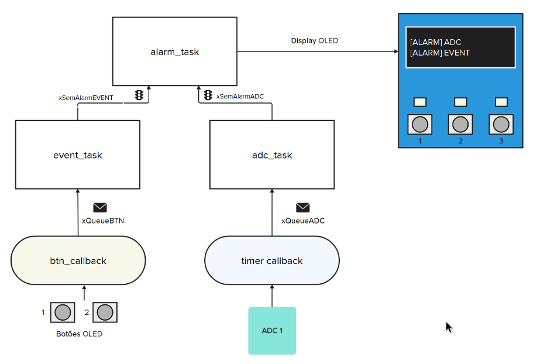

# 24a - AV2 - emb - Data Logger 

> LEIA TODOS OS PASSOS ANTES DE SAIR FAZENDO, TENHA UMA VISÃO GERAL DO TODO ANTES DE COMECAR .

Prezado aluno:

- A prova é prática, com o objetivo de avaliar sua compreensão a cerca do conteúdo da disciplina. 
- É permitido consulta a todo material pessoal (suas anotações, códigos), lembre que você mas não pode consultar outros seres vivos!
- chatgpt / copilot / ... liberados!
- Duração total: 2h 

Sobre a avaliacão:

1. Você deve satisfazer ambos os requisitos: funcional, estrutura de código e qualidade de código para ter o aceite na avaliação;
1. A avaliação de C deve ser feita em sala de aula por um dos membros da equipe (Professor ou Técnico);
1. A entrega do código deve ser realizada no git.
1. Realizar um commit a cada 15 minutos, vamos avisar vocês!

## Entrega

Vamos criar um protótipo de um datalogger, onde um sistema embarcado coleta periodicamente valores e eventos do mundo real, formata os dados e envia para um dispositivo externo. O envio da informação será feito pela UART. O datalogger também irá verificar algumas condições de alarme.

O firmware vai ser composto por três tasks: `adc_task`, `events_task` e `alarm_task` além de duas filas: `xQueueEvent` e `xQueueBtn`. A ideia é que a cada evento de botão ou a cada novo valor do ADC, um log formatado seja enviado pela UART (printf) e uma verificação das condições de alarme checadas, se um alarme for detectado a task_alarm deve ser iniciada. O log (UART/printf) deve possuir um timestamp que indicará quando o dado foi lido pelo sistema (em segundos, desde o que o sistema foi iniciado).

A seguir um exemplo de log, nele conseguimos verificar a leitura do AFEC, e no segundo 04 (5ª do log) o botão 1 foi pressionado, e depois solto no segundo 07. No segundo 08 (9ª do log) o AFEC atinge um valor maior que o limite e fica assim por mais 5 segundos, ativando o alarme no segundo 14.

``` 
 [ADC  ] 1s   1220
 [ADC  ] 2s   1222
 [ADC  ] 3s   1234
 [ADC  ] 4s   1225
 [EVENT] 4s   1:1
 [ADC  ] 5s   1245
 [ADC  ] 6s   1245
 [EVENT] 7s   1:0
 [ADC  ] 8s   4000
 [ADC  ] 9s   4004
 [ADC  ] 10s  4002
 [ADC  ] 11s  3001
 [ADC  ] 12s  4001
 [ADC  ] 13s  4002
 [ALARM] 14s  ADC 
```

O digrama a seguir deve ser seguido no desenvolvimento do firmware:



### `TICKs`

Os ticks dão uma indicação de tempo e devem indicar um valor absoluto desde que a placa foi inicializada. Para isso vocês devem usar o recurso do timer de tempo absoluto, converter o valor de `ms` para `s`:
```
to_ms_since_boot(get_absolute_time());.
```

### `timer_callback`

Um evento de timer gerado a cada `1s` que será responsável por fazer a leitura do ADC e enviar o valor lido para a fila `xQueueADC`. 

### `adc_task`

> ⚠️ USAR ADC 1 que está conectado no BTN3 do OLED! ⚠️

A `adc_task` vai ser responsável por coletar dados de uma entrada analógica via um callback de Timer, os dados devem ser enviados do *callback* do TIMER via a fila `xQueueADC` com a frequência de uma amostra por segundo (1hz). A cada novo dado do ADC a condição de alarme deve ser verificada, o alarme de ADC será liberado se o ADC ficar por 5 segundos no mesmo valor.

A adc_task, ao receber os dados deve realizar a seguinte ação:

1. Enviar pela UART o novo valor no formato a seguir:
    - `[ADC  ] TICK  $VALOR`  --->  ( `$VALOR` deve ser o valor lido da fila )
1. Verificar a condicão de alarme:
    - 5 segundos com o valor do ADC maior que 3000
    
Caso a condição de alarme seja atingida enviar um alarme para o semáforo `xSemAlarmADC` indicando que o alarme foi gerado por conta do ADC.

Exemplo do que a task deve gerar no terminal:

```
[ADC] 12 1410 
[ADC] 13 1401 
[ADC] 14 1417 
[ADC] 15 1410 
[ADC] 16 1414 
[ADC] 17 1417 
[ADC] 18 1409 
[ADC] 19 1417 
[ADC] 20 1414 
[ADC] 21 1402 
```

### `event_task` 

> ⚠️ Usar apenas BTN1 e BTN2, pois o BTN3 vai ser utilizado para o ADC ⚠️

A `event_task` será responsável por ler eventos de botão (subida, descida), para isso será necessário usar as interrupções nos botões e enviar pela fila `xQueueEvent` o ID do botão e o status (on/off). Um alarme de botão deverá ser ativado se dois ou mais botões forem apertado ao mesmo tempo! 

A cada evento a task deve formatar e enviar um log pela UART e também verificar a condição de alarme. A event_task, ao receber os dados via fila deve realizar a seguinte ação:

1. Enviar pela UART o novo valor no formato a seguir:
    - `[EVENT] TICK $ID:$status`
        - `$ID`: id do botão (1,2,3)
        - `$status`: 1 (apertado), 0 (solto)
1. Verificar a condição de alarme:
    - Dois botões pressionados ao mesmo tempo
    
1. Caso a condição de alarme seja atingida, liberar o semáforo `xSemAlarmEvent`.

Exemplo do que a task deve exibir no terminal (removi o adc para facilitar a visualização):

```
[EVENT] 15 s 2:1
[EVENT] 15 s 1:0
[EVENT] 15 s 2:0
[EVENT] 15 s 2:0
```


### `alarm_task`

Responsável por gerenciar cada um dos tipos de alarme diferente: `adc` e `event`. A cada ativacão do alarme a task deve emitir um Log pela serial:

- `[ALARM] EVENT`:  Para evento do botão
- `[ALARM] ADC `: Para evendo do adc

Os alarmes são ativados pelos semáforos `xSemAlarmEvent` e `xSemAlarmADC`. Uma vez ativado o alarme, o mesmo deve ficar ativo até a placa reiniciar.

Ao ativar um alarme exibir no OLED um log simplificado (um por linha):

```
[ALARM] ADC
[ALARM] EVENT
```

## Rubrica

> Não possuir erro de qualidade de código detectado no github actions.

- [ ] ⚠️ Leitura do ADC via callback do Timer em 1hz e envio do dado para a fila `xQueueADC`
- [ ] Usa o tempo absoluto do timer para medir o `ticks` em segundos
- [ ] ⚠️ Leitura dos botões do OLED via ISR e envio do dado para fila `xQueueEvent`
- [ ] 
- `task_afec`
    - log:  `[ADC  ] TICKs $VALOR`
    - ⚠️ Faz a leitura do ADC no callback de timer e envia o dado para a fila
    - alarme se o valor do AFEC estiver maior que 3000 durante 5s
        - libera semáforo `xSemAlarmADC`
        - 
- `task_event`
    - Lê os dois botões 1 e 2
    - ⚠️ Usa ISR e envia o status do callback para a task via fila
    - log:  `[EVENT] TICKs $ID:$STATUS` 
    - alarme se houver dois botões pressionados ao mesmo tempo
        - libera semáforo `xSemAlarmEvent`
        - 
- `task_alarm`
    - ⚠️verifica dois semáforos: `xSemAlarmADC` e `xSemAlarmTicks`
    - quanto liberado o semáforo, gerar o log:  `[ALARM] TICKs $ALARM` 
    - ⚠️ Exibir no OLED as informações do alarme
    
:bangbang: :warning: :bangbang: Não devem ser utilizadas **variáveis globais**, todo o processo deve ser feito através das filas e semáforos. :bangbang: :warning: :bangbang:

### Dicas

Comece pela `task_event` depois faça a `task_afec` e então a `task_alarm`.
